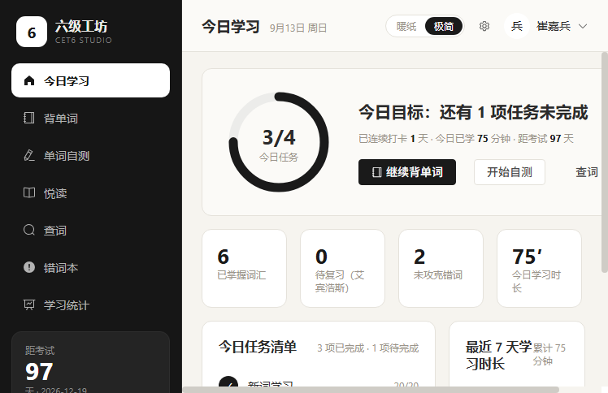
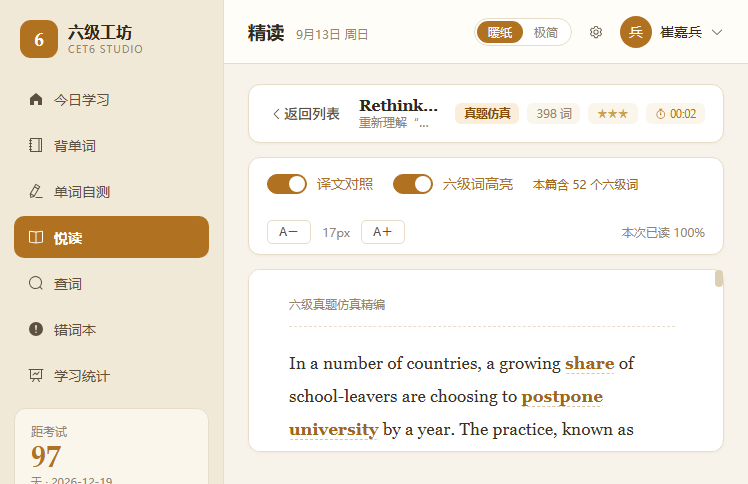

# CET6 Studio · 六级工坊

一个面向 CET-6 备考的个人英语学习平台。**前后端分离**，包含背单词、单词自测、**悦读**、离线词典查词（支持前缀联想）、错词本、学习统计等模块。

> 本项目由本人独立开发，用于个人备考与求职作品展示。

---

## 界面预览

> 截图取自本机实跑环境（演示账号登录后的真实数据），非设计稿。全套共 36 张，含双主题与手机端，见 [`docs/`](docs/)。

<table>
  <tr>
    <td width="50%"></td>
    <td width="50%"></td>
  </tr>
  <tr>
    <td><sub><b>登录页</b> · 暖纸主题，左侧为功能概览</sub></td>
    <td><sub><b>今日学习</b> · 极简主题，任务进度与连续打卡一目了然</sub></td>
  </tr>
  <tr>
    <td width="50%"></td>
    <td width="50%"></td>
  </tr>
  <tr>
    <td><sub><b>悦读</b> · 12 篇精选文章，按体裁 / 难度 / 阅读状态筛选</sub></td>
    <td><sub><b>精读</b> · 六级词自动高亮，逐段译文对照，点词即查</sub></td>
  </tr>
  <tr>
    <td width="50%"></td>
    <td width="50%"></td>
  </tr>
  <tr>
    <td><sub><b>设置</b> · 词典 / 发音 / 翻译源可切换，带连通性自测</sub></td>
    <td><sub><b>学习统计</b> · ECharts 时长趋势与词汇掌握度</sub></td>
  </tr>
</table>

---

## 一、技术栈

| 层 | 技术 | 说明 |
|----|------|------|
| 前端 | Vue 3 + Vite + Element Plus + Pinia + Vue Router + Axios + ECharts | 组合式 API（`<script setup>`） |
| 后端 | JDK 17 + Spring Boot 3.2.5 + MyBatis-Plus 3.5.5 | `Controller → Service → Mapper` 三层 |
| 数据库 | MySQL 8.0 | utf8mb4，17 张表 |
| 鉴权 | JWT（jjwt 0.11.5）+ Spring Security Crypto（BCrypt） | 无状态，拦截器校验 |
| 数据源 | ECDICT 开源英汉词典 | 76 万词条清洗后入库 5.7 万条 |

---

## 二、系统架构

```
┌──────────────────────────────────────┐
│  Vue3 + Vite + Element Plus   :5173  │
│  Pinia 状态 · Vue Router(hash)        │
└───────────────┬──────────────────────┘
                │  axios  /api/**  (dev 走 Vite 代理)
┌───────────────▼──────────────────────┐
│  Spring Boot 3.2   :8080             │
│  AuthInterceptor(JWT) → Controller    │
│    → Service → Mapper(MyBatis-Plus)   │
│  统一返回体 Result / 全局异常处理       │
└───────────────┬──────────────────────┘
                │  JDBC
        ┌───────▼────────┐
        │  MySQL 8       │  cet6_sprint
        │  17 张表        │
        └────────────────┘
```

---

## 三、目录结构

```
cet6-studio/
├── backend/                      Spring Boot 工程
│   ├── pom.xml
│   └── src/main/
│       ├── java/com/cet6/sprint/
│       │   ├── Cet6SprintApplication.java
│       │   ├── common/           Result / 全局异常 / JwtUtil / UserContext
│       │   ├── config/           WebConfig(CORS+拦截器) / MyBatisPlusConfig / BeanConfig
│       │   ├── entity/           17 个实体，对应 17 张表
│       │   ├── mapper/           MyBatis-Plus BaseMapper + 自定义 SQL
│       │   ├── dto/              入参对象（含校验注解）
│       │   ├── vo/               出参对象
│       │   ├── service/          业务接口
│       │   │   └── impl/         业务实现
│       │   └── controller/       REST 接口
│       └── resources/
│           ├── application.yml        公共配置（默认激活 dev profile）
│           ├── application-dev.yml     开发环境：打印 SQL、debug 日志
│           └── application-prod.yml    生产环境：关闭 SQL 打印、收敛日志
├── frontend/                     Vue3 工程
│   └── src/
│       ├── api/request.js        axios 封装（拦截器）
│       ├── api/index.js          接口定义
│       ├── router/               路由 + 登录守卫
│       ├── store/user.js         Pinia 用户状态
│       ├── composables/theme.js  双主题切换（模块级单例）
│       ├── layout/MainLayout.vue 侧边栏布局（≤768px 自动转抽屉）
│       ├── components/ClickableText.vue   ★ 点击查词组件（阅读器复用）
│       └── views/                14 个页面
├── sql/
│   ├── schema.sql                建库建表（基础表）
│   ├── reading.sql               阅读模块建表
│   ├── third_batch.sql           听力 / 写作 / 翻译建表 + 种子数据
│   ├── settings.sql              外部数据源配置表（`t_app_config`）
│   └── load_word_data.sql        词库导入
└── docs/                         界面截图与设计说明
```

---

## 四、数据库设计（17 张表）

| 表 | 作用 | 关键设计 |
|----|------|----------|
| `t_user` | 用户 | 密码 BCrypt 存储 |
| `t_word` | 词库（5.7 万条） | 唯一索引 `word`；冗余标记 `is_cet6` |
| `t_dict_query` | **查词计数** | 唯一键 `(user_id, word)` → upsert 累加 |
| `t_word_grade` | 单词掌握度 | 唯一键 `(user_id, word_id)`；存下次复习日期 |
| `t_wrong_word` | 错词本 | 唯一键去重，答错则次数 +1 |
| `t_quiz_record` | 测验记录 | 汇总：题数 / 正确数 / 正确率 |
| `t_quiz_detail` | 测验明细 | 关联 `record_id`，逐题作答 |
| `t_study_log` | 学习日志 | 唯一键 `(user, date, module)` → upsert 累加 |
| `t_checkin` | 打卡 | 唯一键 `(user, date)`，`INSERT IGNORE` 幂等 |
| `t_task_record` | 每日任务 | 唯一键 `(user, date, task_key)` → upsert 推进 |
| `t_app_config` | **外部数据源配置** | 键值对存储；词典 / 发音 / 翻译源在应用内切换，30s 本地缓存 |
| `t_article` | **阅读文章** | `content` / `translation` 段落严格一一对应，前端逐段对照 |
| `t_reading_record` | **阅读记录** | 唯一键 `(user, article)`；进度取 `GREATEST`、时长累加 |
| `t_translation` | **翻译题库** | 题目含 `key_points`（要点，`;` 分隔），供覆盖率评分 |
| `t_writing` | **写作题库** | 含 `requirement` / `outline` / `reference_essay` / 字数区间 |
| `t_listening` | **听力材料** | 含原文 `script`；题目单独存 `t_listening_question` |
| `t_listening_question` | **听力题目** | `options_json` 存选项数组；`answer_index` 仅后端可见 |

---

## 五、快速启动

### 1. 准备数据库

```bash
# 建库建表（需 MySQL 8 已启动，账号密码见 application.yml）
mysql -uroot -p --default-character-set=utf8mb4 < sql/schema.sql
mysql -uroot -p --default-character-set=utf8mb4 < sql/reading.sql
```

### 2. 导入词库（离线，需先下载 ECDICT）

```bash
# 下载 ECDICT（约 65MB）
curl -o ecdict.csv https://raw.githubusercontent.com/skywind3000/ECDICT/master/ecdict.csv

# 清洗：筛选「有考试标签或高频」且「有释义」的词条，输出 TSV
# 见仓库外的 etl.py 脚本，产出 word_import.tsv

# 导入（注意 --local-infile=1）
mysql -uroot -p --local-infile=1 cet6_sprint < sql/load_word_data.sql
```

导入后应得到 **57841 条词条**，其中 **5407 条为六级大纲词**。

> 若暂时不导入词库，系统仍可启动，但背单词和查词会没有数据。

### 3. 启动后端

```bash
cd backend
mvn clean package -DskipTests
java -jar target/cet6-sprint-backend-1.0.0.jar
# 启动后：http://localhost:8080/api/ping 返回 {"code":200,...}
```

### 4. 启动前端

```bash
cd frontend
npm install
npm run dev
# 打开 http://localhost:5173
```

首次使用先点「立即注册」创建账号。

### 5. 环境配置（Profile）

后端按 **dev / prod** 两个 profile 拆分配置，默认激活 `dev`：

| 文件 | 作用 |
|------|------|
| `application.yml` | 公共配置（数据源、MyBatis-Plus、JWT、每日任务目标） |
| `application-dev.yml` | 开发：打印 SQL、`com.cet6.sprint` 日志级别 `debug` |
| `application-prod.yml` | 生产：关闭 SQL 打印、日志收敛为 `info` / `warn` |

切换到生产环境：

```bash
java -jar target/cet6-sprint-backend-1.0.0.jar --spring.profiles.active=prod
```

生产环境建议用环境变量覆盖敏感配置（不要沿用仓库里的默认值）：

| 环境变量 | 说明 | 默认值 |
|----------|------|--------|
| `CET6_PROFILE` | 激活的 profile | `dev` |
| `CET6_DB_URL` | 数据库连接串 | 本机 `cet6_sprint` |
| `CET6_DB_USER` / `CET6_DB_PASSWORD` | 数据库账号密码 | `root` / `root` |
| `CET6_JWT_SECRET` | JWT 签名密钥（HS256，至少 32 字节） | 仓库内置默认值（**仅限本地**） |

---

## 六、接口清单

| 方法 | 路径 | 说明 | 需登录 |
|------|------|------|:---:|
| POST | `/api/auth/register` | 注册 | ✗ |
| POST | `/api/auth/login` | 登录，返回 JWT | ✗ |
| GET | `/api/auth/me` | 当前用户 | ✓ |
| PUT | `/api/auth/profile` | 修改昵称/考试日期/目标分 | ✓ |
| GET | `/api/dashboard` | 今日学习页全部数据 | ✓ |
| GET | `/api/word/today` | 今日新词 | ✓ |
| GET | `/api/word/review` | 待复习词（艾宾浩斯到期） | ✓ |
| POST | `/api/word/grade` | 提交掌握度 | ✓ |
| GET | `/api/word/page` | 词库分页检索 | ✓ |
| GET | `/api/dict/lookup` | **查词（计数 +1）** | ✓ |
| GET | `/api/dict/suggest` | **查词前缀联想（只读，不计数）** | ✓ |
| GET | `/api/dict/hot` | **热词榜（次数倒序）** | ✓ |
| GET | `/api/dict/recent` | 最近查询 | ✓ |
| GET | `/api/dict/stats` | 查词统计 | ✓ |
| POST | `/api/dict/wrong` | 查到的词加入错词本 | ✓ |
| GET | `/api/quiz/generate` | 生成题目（不含答案） | ✓ |
| POST | `/api/quiz/submit` | 提交答卷并判分 | ✓ |
| GET | `/api/quiz/history` | 测验历史 | ✓ |
| GET | `/api/reading/list` | **文章列表（分类 / 难度 / 关键词筛选）** | ✓ |
| GET | `/api/reading/{id}` | **文章详情（含译文与六级词列表）** | ✓ |
| POST | `/api/reading/{id}/open` | 记录一次打开（打开次数 +1） | ✓ |
| POST | `/api/reading/progress` | **上报阅读进度与新增时长** | ✓ |
| GET | `/api/reading/stats` | 阅读概览统计 | ✓ |
| GET | `/api/wrong/list` | 错词列表 | ✓ |
| POST | `/api/wrong/master` | 标记/取消攻克 | ✓ |
| DELETE | `/api/wrong/{id}` | 移出错词本 | ✓ |
| GET | `/api/translation/random` | **随机取翻译题** | ✓ |
| POST | `/api/translation/submit` | **提交译文，返回要点覆盖率 + 参考译文** | ✓ |
| GET | `/api/writing/random` | **随机取写作题** | ✓ |
| POST | `/api/writing/submit` | **提交作文，返回字数达标 + 关键词覆盖 + 参考范文** | ✓ |
| GET | `/api/listening/random` | **随机取听力材料（不含答案）** | ✓ |
| POST | `/api/listening/submit` | **提交听力作答，服务端判分并返回解析** | ✓ |
| GET | `/api/exam/prepare` | **组卷：听力 + 翻译 + 写作 各一份** | ✓ |
| POST | `/api/exam/finish` | **结束模考，按用时登记学习时长** | ✓ |
| GET | `/api/stats/overview` | 统计总览 + 趋势 | ✓ |

---

## 七、核心实现要点

### 1. 查词计数：一条 SQL 搞定 upsert
`t_dict_query` 上有唯一键 `(user_id, word)`，配合：
```sql
INSERT INTO t_dict_query (user_id, word, query_count) VALUES (?, ?, 1)
ON DUPLICATE KEY UPDATE query_count = query_count + 1, last_time = NOW()
```
**有则 +1，无则插入**，一条语句完成。比「先 select 判断、再 insert/update」少两次数据库往返，且并发下由数据库保证原子性，不会出现两个请求都判定为「不存在」而插入重复行。

热词榜直接 `ORDER BY query_count DESC` 取，配合 `idx_rank (user_id, query_count DESC)` 索引。

### 2. 查词前缀联想：让 `uk_word` 索引真正生效

联想接口只做**前缀匹配**，不做全文模糊：

```sql
SELECT w.* FROM t_word w
WHERE w.word LIKE 'all%'                                   -- ← 关键
ORDER BY w.is_cet6 DESC, COALESCE(NULLIF(w.frq,0),999999) ASC
LIMIT 10
```

三个容易被忽略的点：

- **`LIKE 'all%'` 走索引，`LIKE '%all%'` 不走。** `t_word.word` 上有唯一索引，前缀匹配可以退化为索引范围扫描（range scan），5.7 万行毫秒级返回；前置通配符则会让索引完全失效，退化成全表扫描。这是本项目坚持用「前缀联想」而非「模糊搜索」的根本原因——不是不想做，是这样做在数据量面前才站得住。
- **`frq = 0` 要兜底。** ECDICT 里词频字段缺数据时是 0，直接 `ORDER BY frq ASC` 会让这些「没有词频」的词排到最高频词前面。用 `COALESCE(NULLIF(frq,0), 999999)` 把它们沉到末尾。
- **联想不计数。** `/suggest` 是纯只读接口，不写 `t_dict_query`。否则用户每敲一个字母就产生一次计数，热词榜会被输入过程污染，失去「查得最多 = 最没记住」的意义。

前端用 `el-autocomplete`，`:debounce="220"` 防抖——没防抖的话输入 "alleviate" 会打出 9 次请求。另外做了两件事：

- **空输入回退「最近查询」。** 刚聚焦输入框就给出最近查过的词，省去重新回忆要查什么。
- **短时去重。** `el-autocomplete` 选中候选时会触发 `select`，紧接着 `keyup.enter` 也会走到查询函数，一次操作被记两次，计数就失真了。用「同词 400ms 内不重复提交」兜住。

### 3. 做题时点词查词：事件委托
`ClickableText.vue` 把一段文本用正则 `/`[A-Za-z][A-Za-z'-]*/g` 切成「单词 / 非单词」片段，单词渲染成 `.ct-word`。

**不给每个词单独绑定 click**，而是在容器上绑一个监听器，通过 `event.target.closest('.ct-word')` 反查点中了哪个词。原因：一篇文章几百个单词，逐个绑定会产生几百个监听器；委托只需 1 个，且点击时不需要遍历虚拟 DOM 找对应回调。这是标准的前端性能优化手段。

浮层定位用 `getBoundingClientRect()` 计算，靠近视口右/下边界时自动翻转到另一侧。

### 4. 艾宾浩斯复习排期
每次提交掌握度时计算下次复习日期：

| 掌握程度 | 间隔 |
|---------|------|
| 不认识 | +1 天（明天重来） |
| 模糊 | +2 天 |
| 认识 | 4 / 8 / 16 / 30 天递增（随复习次数翻倍，30 天封顶） |

首页和背单词页的「待复习」= `next_review <= CURDATE() AND grade < 2`。

### 5. 每日任务进度：取总数而非增量
`upsertProgress` 用 `GREATEST(finished, ?)` 更新，传入的是**当日累计总数**（从 `t_study_log` 聚合而来），而不是每次 +1。这样即使接口被重复调用、或并发提交，进度也不会被重复累加——天然幂等。

### 6. 唯一索引 + INSERT IGNORE 兜住并发
打卡、测验明细初始化等场景用唯一索引 + `INSERT IGNORE`，重复请求不会报错也不会产生脏数据。

### 7. 冗余字段换查询性能
词库里「是否六级词」本可以写 `tag LIKE '%cet6%'`，但前置通配符会导致索引失效、全表扫描。导入时用 `FIND_IN_SET` 精确回填 `is_cet6` 字段并建索引，背单词的随机取词直接走索引。

### 8. JWT 鉴权链路
登录成功 → 签发 JWT（HS256，payload 只放 userId/username，不放敏感信息）→ 前端存 localStorage → axios 请求拦截器统一加 `Authorization: Bearer xxx` → 后端 `AuthInterceptor` 校验并写入 `UserContext`（ThreadLocal）→ Service 层用 `UserContext.getUserId()` 取用户，**不用在每个方法上传 userId** → `afterCompletion` 里 `remove()`，防止线程池复用导致用户串号。

> 接口返回 401 时前端自动清 token 并跳登录页。

### 9. 密码安全
BCrypt 加密（自带随机盐，同一密码每次哈希结果都不同）。登录失败时，「账号不存在」和「密码错误」返回**同一句提示**，避免攻击者枚举出系统中存在哪些账号。

### 10. 判分放在后端
出题接口 `/api/quiz/generate` **不下发正确答案**（`QuizQuestionVO` 里没有 correctIndex 字段），用户在提交时才由后端比对判分，防止直接看接口响应作弊。

### 11. 统一返回体 + 全局异常
所有接口返回 `{code, message, data}`，前端拦截器统一解包。业务异常抛 `BusinessException`，参数校验失败、系统异常都在 `@RestControllerAdvice` 里收敛处理，Controller 只写正常流程。

### 12. 悦读：四个不显眼但重要的决策

#### （1）六级词高亮：不存库，改成「内存词表 + 按需计算」

判断「文中某个词是不是六级词」，有两条省事的路：每篇文章去 JOIN 一次 `t_word`，或者导入时把结果算好写成一列。两条都没走：

- **不 JOIN** —— 每打开一篇文章就多一次数据库往返，而这件事本质只是「几百个词的集合 ∩ 5407 个词的集合」。
- **不预存列** —— 预存意味着以后重新界定大纲词汇时，要重跑全量内容导入。

最终方案：应用启动时把 `is_cet6 = 1` 的 5407 个词一次性读进内存 `HashSet`，请求到达时对正文正则分词、逐词 `contains` 判断。5000 多个短字符串常驻内存不到 1 MB，换来**零数据库开销**；结果按文章 ID 缓存，正文不变就不重算。

已知代价：**词形变化匹配不上**（`exploited` 与 `exploit` 会被当成两个词，漏标一个）。要彻底解决需引入词形还原表（ECDICT 的 `lemma.en.txt`），列为改进项。

#### （2）阅读时长：为什么不能「每次上报记一笔」

阅读器每 10 秒上报一次（间隔太短会频繁写库，太长则关页面时丢时长）。而 `t_study_log` 的时长单位是**分钟**——写成 `addSeconds / 60` 的话，10 ÷ 60 恒等于 0，统计页的阅读时长会永远是 0。

解法是**总量差值法**：阅读记录里存累计秒数，学习日志里存累计分钟数，两者取 `floor` 后求差，只补记差额。

```java
int shouldMinutes = readingRecordMapper.totalSeconds(userId) / 60;
int loggedMinutes = studyLogMapper.totalMinutesOfModule(userId, "reading");
if (shouldMinutes > loggedMinutes) {
    studyLogMapper.accumulate(userId, today, "reading", shouldMinutes - loggedMinutes, 0);
}
```

好处是**幂等**——同一个请求重放十次，差额为 0 就一行不写。代价是跨天时有不到 1 分钟的归属误差。

#### （3）进度上报拆成两个接口

`read_count`（打开次数）只在 `/open` 里 +1，`/progress` 完全不碰它。两者若合并，一次阅读中前端会调几十次 `/progress`，打开次数就被算成几十次。

同理，`/progress` 中 `duration_sec` 用**累加**、`progress` 用 `GREATEST` 取最大：时长应当累计（同一篇反复读确实花了时间），进度只进不退（重读不该把记录打回 0）。

#### （4）译文「逐段对照」而不是「整篇并排」

`content` 与 `translation` 都以空行分段存储，**段落数严格一一对应**——导入脚本会校验，段数不一致直接拒绝入库。

前端把两列切成数组后逐段渲染，译文插在对应英文段落下面。并排两栏实现更省事，但读者视线要在两栏间来回找位置；逐段插入则想不看就跳过，精读与泛读两种模式都能用。

### 13. 界面主题：双主题一键切换（书房暖纸 / 极简黑白）

原版整站是青绿色，但颜色**写死在 12 个文件里**——想换一次风格就得翻遍所有 `<style>` 块。后来借「换个好看点的界面」的机会把颜色收口到 `--c6-*` 变量族，并基于同一套变量新增第二套皮肤，顶部胶囊切换即可在两套风格间一键切换，选择持久化在 `localStorage`。

两套主题：

| 主题 | 关键词 | 侧栏 | 内容区 | 英文字体 | 六级词高亮 | 适用场景 |
|------|--------|------|--------|----------|------------|----------|
| **暖纸** | 书卷、温度 | 米色 `#f1e9d8` | 浅纸 `#f7f3ea` | Georgia 衬线体 | 琥珀色 + 加粗 + 虚线下划线 | 日常学习、背词自测，像翻开一本书 |
| **极简黑白** | 克制、阅读 | 近黑 `#161616` | 米白纸 `#f6f4ef` | Inter / Segoe UI 无衬线 | 细灰下划线（无加粗、无色块） | 长篇英文精读，冷静护眼 |

**暖纸落地要点**：

- **`main.css` 定义 `--c6-*` 变量族**：主色 4 档、表面 4 层（纸底 / 侧栏 / 顶栏 / 卡片）、文字 2 级、描边与浅底 5 个。各页面只引用变量，现在再换肤只改这一个文件。
- **同步覆盖 Element Plus 的 `--el-*` 变量**：primary 全档 + 圆角 + 文字色 / 边框色 / 填充色。不这么做就得逐个页面写 `:deep()` 去掰组件库样式。
- **衬线体只给英文**：文章标题、阅读正文、单词。中文一律无衬线——宋体在小字号下笔画会糊成一团。
- **数字单独一套字体，不与标题共用衬线**：Georgia 用的是「旧式数字」（old-style figures）——`3/4/5/7/9` 会沉到基线以下、`6/8` 顶出上沿、`0/1/2` 缩在中间，一排统计数字看上去高低起伏，像没对齐。改用 Palatino Linotype（等高「落地数字」）+ `font-variant-numeric: lining-nums tabular-nums`，既有书卷气又整齐，等宽还能让倒计时数字跳动时不左右晃。抽成 `--c6-num` 变量，与 `--c6-serif` 分开。
- **六级词高亮的配色逻辑重做了**。原来「六级词用暖色，hover 用主题色（青绿）」分工清晰；主题色本身变成赭石之后，两个信息都靠颜色表达就分不清了。现在改成**高亮靠色相**（琥珀 vs 深棕正文）、**交互靠形态**（浅底色块 + 实线 vs 常驻虚线下划线）。

**极简黑白落地要点**：

- **只覆写变量不动结构**：`main.css` 用 `[data-theme='minimal']` 覆盖 `:root` 的 `--c6-*` / `--el-*`，所有引用变量的地方自动跟随；少数组件级覆写（侧栏、分类芯片、六级词下划线、图表取色）通过 `useTheme()` 感知主题变化完成。
- **近黑窄边栏 + 米白大阅读区**：侧栏 `#161616`、内容区 `#f6f4ef`；导航项默认浅灰，激活态白底墨字；logo 也翻转为白底黑字，与侧栏形成强对比但低饱和。
- **去彩色、去渐变**：分类标签从彩色块改成「浅底 + 细灰描边」；Dashboard 周柱图、Stats 两张 ECharts 全部改成墨色 / 灰阶；青色渐变、粉红标记线、红色及格线全部压掉。
- **六级词高亮只留细下划线**：`ClickableText` 在极简模式下把 `.ct-cet6` 改成 `color: var(--c6-text)` + `font-weight: 400` + `border-bottom: 1px solid #9a9a9a`，长文里不再有一大片琥珀色块打断阅读。
- **切换机制**：`src/composables/theme.js` 维护模块级单例 `theme` ref；`main.js` 在挂载前引入它，立刻把 `data-theme` 挂到 `<html>`，避免首屏闪烁；`MainLayout` 顶部暴露「暖纸 / 极简」两态胶囊按钮。

验证方式：CDP 驱动无头 Edge 走完全站截图（`docs/theme-*.png`、`docs/theme2-*`）。暖纸首次验证用 `getComputedStyle` 回读 `--c6-primary` 等变量，确认渲染层生效；本次新增双主题验证也回读了 `--c6-sidebar` / `--c6-bg` / `--c6-primary`，确认暖纸为 `#f1e9d8/#f7f3ea/#b07120`、极简为 `#161616/#f6f4ef/#1a1a1a`，杜绝「文件改了但渲染层没生效」的错觉。缩略截图上的分类标签看着像实心底，回读才发现是浅底 `rgb(250,238,218)`，靠眼睛判断会误改。数字字体用了更硬的验证：`canvas.measureText()` 的 `actualBoundingBoxAscent / Descent` 逐个量 0–9 的字形高度。

数字字体用了更硬的验证：`canvas.measureText()` 的 `actualBoundingBoxAscent / Descent` 逐个量 0–9 的字形高度。Georgia 实测上沿极差 7px、`3/4/5/7/9` 全部下沉到基线以下 7px；换 Palatino Linotype 后全部齐平、零下沉。**注意 `getBoundingClientRect()` 量到的是行高不是字形高度，测不出这个问题**——第一次就是这么测的，得到了「新旧都是 0 极差」的错误结论。

### 14. 构建产物拆包：把「只用一次的大依赖」赶出首屏

`vite build` 曾报出 `index-*.js` 1.21 MB、`Stats-*.js` 1.04 MB，均超过默认 500 KB 告警线。原因是全部 `node_modules` 被打进同一个主包（ECharts 全量引入尤其重）。

处理分两步，缺一不可：

- **`manualChunks` 拆包**：在 `vite.config.js` 把 `echarts` / `zrender` → `vendor-echarts`、`element-plus` → `vendor-element-plus`、其余 → `vendor`。因为只有「学习统计」页引用 ECharts，而该路由本身已是懒加载，拆出后**首屏根本不下载 ECharts**。
- **ECharts 按需引入**：`Stats.vue` 从 `import * as echarts from 'echarts'`（含全部图表类型）改为 `echarts/core` + 仅注册 `LineChart` / `BarChart` 与 `Grid` / `Tooltip` / `MarkLine` 组件 + `CanvasRenderer`。同时把 `new echarts.graphic.LinearGradient(...)` 换成 ECharts 原生对象式渐变 `{ type:'linear', colorStops:[...] }`，少一层对 `graphic` 命名空间的依赖。

> 注意：本机 `vite build` 处理大 chunk 时会在 emit 阶段 OOM，需要 `NODE_OPTIONS=--max-old-space-size=4096` 才能稳定通过。

### 15. 移动端适配：侧栏转抽屉

学生高频在手机上看，但原版是「固定 224px 桌面侧栏」。适配没有重写布局，而是**只在窄屏切换侧栏形态**：

- `MainLayout` 增加 `sidebarOpen` 状态；`@media (max-width: 768px)` 下 `.sidebar` 改为 `position: fixed` + `translateX(-100%)`，点顶栏汉堡按钮加 `.sidebar-open` 滑入，配半透明背板遮罩。
- 路由切换自动收起（`watch(route.path)`），否则新页面会被遮罩挡住。
- 桌面端媒体查询不生效，布局与交互**完全不变**——这是选「CSS 切换形态」而非「写两套模板」的原因：改动面小、不会回归桌面体验。
- 页面级断点：Dashboard 横向卡片行改纵向堆叠 / 两列，Stats 汇总卡 6 列 → 2 列、图表降高，悦读列表 3 列 → 2 列 → 1 列。

---

## 八、常见面试追问

**Q：为什么用 JWT 不用 Session？**
Session 数据存服务端，多实例部署要做 Session 共享（存 Redis 或粘性会话）；JWT 把状态放在客户端签名令牌里，服务端不存任何东西，天然适合水平扩展。代价是**无法主动失效**——所以本项目有效期设 72 小时，真要强制下线需配合 Redis 黑名单。

**Q：Token 存 localStorage 有什么风险？**
有 XSS 风险（脚本可读）。更安全的做法是 HttpOnly + Secure Cookie，配合 CSRF Token。本项目是个人学习项目做了取舍；生产环境还应加 CSP 响应头、对用户输入做转义。

**Q：为什么用 MyBatis-Plus 而不是 JPA？**
SQL 可控。复杂统计（按日期分组、多表 JOIN、upsert）用 MyBatis 写原生 SQL 更直观，分页插件也省去手写 limit。代价是单表 CRUD 要自己写 Mapper 继承 `BaseMapper`。

**Q：`ORDER BY RAND()` 取随机词有性能问题吗？**
有。大表上会全表扫描 + 排序。本项目限定在 `is_cet6 = 1`（5407 行）范围内，耗时可接受。数据量再大应改为「随机生成 id 区间再查」或「预生成随机序列表」。

**Q：`NOT EXISTS` 和 `NOT IN` 有什么区别？**
`NOT IN` 的子查询结果若含 NULL，整个条件会返回空集（三值逻辑陷阱）；`NOT EXISTS` 不受影响，且数据量大时通常能走半连接优化。取「还没学过的词」用的是 `NOT EXISTS`。

**Q：如何防止越权操作别人的数据？**
所有涉及用户数据的查询都带 `user_id = UserContext.getUserId()` 条件；按主键操作时（如错词本）先查出来校验 `userId` 归属，不匹配返回 403。

**Q：词库数据哪来的？**
ECDICT 开源英汉词典（76 万词条）。写脚本清洗：保留「有考试标签或语料库词频前 5 万」且「有释义」的词条，转义后走 `LOAD DATA LOCAL INFILE` 批量导入，最终 5.7 万条，其中六级大纲词 5407 条。词典在本地，**查询零网络依赖、零延迟、零成本**。

---

## 九、已知取舍与后续规划

- **第一批功能**：登录、今日学习、背单词、自测、查词、错词本、统计
- **第二批已完成**：
  - 项目更名 CET6 Studio · 六级工坊
  - 查词前缀联想（`/api/dict/suggest`）
  - **悦读模块**：12 篇文章（真题仿真 3 / 公版美文 3 / 外刊新闻 3 / 科普短文 3，中英对照合计 4300 词）、阅读器（点词查词 + 译文对照 + 六级词高亮 + 阅读进度与时长 + 生词一键入错词本）
- **第三批已完成**：**听力**（浏览器 TTS 朗读 + 选择题判分 + 听力原文/解析）、**写作**（命题作文 + 字数达标 + 关键词覆盖率自测）、**翻译**（中译英 + 要点覆盖率自测）、**真题模考**（听力 + 翻译 + 写作组卷，限时 40 分钟，输出估分报告）
- **词典增强**：目前查不到的词返回前缀相似建议；后续可接入词形还原表（ECDICT 的 `lemma.en.txt`）提升命中率
- **阅读/听力待改进**：六级词高亮目前只做原形匹配，词形变化会漏标，需引入词形还原；在线新闻同步暂未自动化（内容经人工精编入库，规避外刊站点时通时不通的问题）；听力发音依赖浏览器 TTS，生产环境应预录 MP3 音频兜底
- **移动端适配（已做基础版）**：主布局 ≤768px 下侧栏自动转抽屉（顶栏汉堡按钮 + 背板遮罩），今日学习 / 学习统计 / 悦读列表已加响应式断点；其余页面仍为桌面优先，待逐步补齐
- **评分模型**：写作 / 翻译当前为「关键词覆盖率」启发式，界面已诚实标注**参考自测，非官方成绩**；后续可升级为分项评分量表（rubric），长期可接 LLM 判分
- **SQL 未版本化**：目前为手工执行的三份脚本，后续可引入 Flyway 做迁移管理
- **未加缓存**：词库查询目前直连 MySQL；后续可加 Redis 缓存高频词

### 关于阅读内容来源

12 篇文章的来源在 `source` / `source_url` 字段中逐篇标注，分四类：

| 分类 | 来源 | 说明 |
|------|------|------|
| `exam` 真题仿真 | 本平台精编 | 按六级阅读的题材分布、篇幅（约 400 词）与行文风格编写，**非真题原文**，不涉及考试机构版权 |
| `essay` 公版美文 | Project Gutenberg | 《爱丽丝梦游仙境》《傲慢与偏见》《波希米亚丑闻》节选，公版作品，零版权风险 |
| `news` 外刊新闻 | NPR | 取自 NPR 公开报道，压缩至六级阅读篇幅后精编，保留原文链接供核对 |
| `science` 科普短文 | 本平台撰写 | 题材取自六级阅读最常见的自然科学领域，数据均标注为估计值或研究表明 |

> 精编而非直接抓取全文，是因为实测 **BBC Learning English / VOA / The Guardian / 维基百科均无法稳定访问**，把时通时不通的在线抓取放进主流程，演示时容易翻车。改为离线内容库后，零网络依赖、零延迟，和现有架构完全一致。

### 关于命名：为什么只改了「对外名」

项目对外名称统一为 **CET6 Studio · 六级工坊**，但 Java 包名 `com.cet6.sprint`、Maven artifactId、数据库名 `cet6_sprint` **保持不变**。

原因：包名和库名属于内部技术标识，改动需要同步 60 多个文件的 `import` 语句、构建脚本和连接配置，出错风险与收益完全不成比例，而且对使用者不可见。**命名带来的价值全在对外展示层**——界面、文档、仓库名——所以只改这一层。

---

## 十、开发环境

| 组件 | 版本 |
|------|------|
| JDK | 17.0.13 |
| Maven | 3.6.3 |
| MySQL | 8.0.21 |
| Node.js | 22.22.2 |
